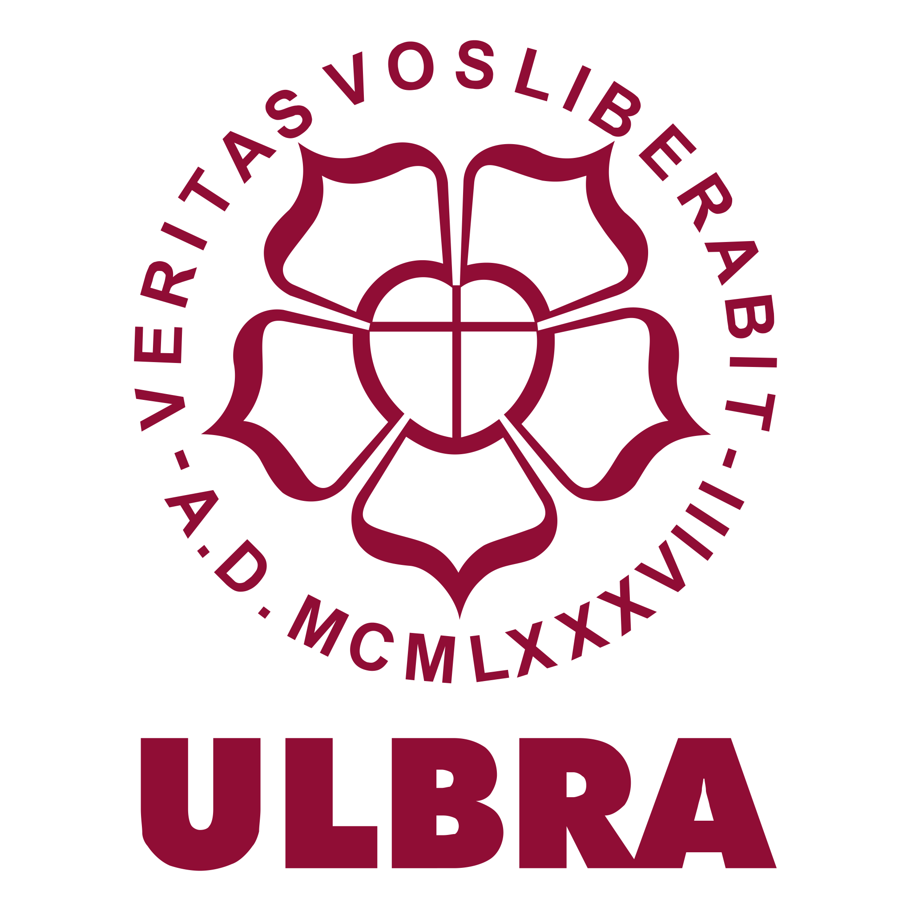

#   Projeto em Java para atividade avaliativa da Universidade Luterana do Brasil <a href="https://www.ulbra.br/" style="color: #800000;">Ulbra</a>

Este projeto foi desenvolvido como parte da atividade avaliativa da Universidade Luterana do Brasil (Ulbra). O objetivo foi implementar soluções em Java para desafios diversos, utilizando boas práticas de programação, como TDD (Test-Driven Development), design modular e otimização de código.

Este projeto consiste em várias aplicações simples desenvolvidas em Java, que implementam funcionalidades como cálculo de descontos, impostos, aposentadoria, circuitos de resistências e muito mais. O objetivo do projeto é praticar a manipulação de entradas e saídas em Java, além de aplicar conceitos de controle de fluxo, manipulação de dados e interação com o usuário.

# Sistema de Gerenciamento de Veículos

Este é um sistema simples de gerenciamento de veículos desenvolvido em **Java**. O sistema utiliza conceitos de **orientação a objetos**, incluindo **herança**, **classes abstratas** e **métodos de acesso**, além de testes de unidade com o framework **JUnit 5**.

---

## 📋 Requisitos do Sistema

### Classe `Veiculo` (Abstrata)
- **Atributos:**
    - `marca` (público): Marca do veículo.
    - `modelo` (público): Modelo do veículo.
    - `ano` (privado): Ano de fabricação do veículo.
- **Métodos:**
    - `informacoesVeiculo()`: Método abstrato para retornar informações detalhadas do veículo.
    - `getAno()` e `setAno(int ano)`: Métodos de acesso ao atributo privado `ano`.

### Classe `Carro`
- **Atributos Adicionais:**
    - `numeroPortas` (público): Quantidade de portas do carro.
- **Implementação do Método `informacoesVeiculo`:**
    - Retorna uma string com as informações completas do carro.

### Classe `Moto`
- **Atributos Adicionais:**
    - `cilindrada` (privado): Cilindrada do motor da moto.
- **Métodos de Acesso:**
    - `getCilindrada()` e `setCilindrada(int cilindrada)`.
- **Implementação do Método `informacoesVeiculo`:**
    - Retorna uma string com as informações completas da moto.

---

## 🚀 Funcionalidades

- **Cadastro de Veículos:**
    - Permite configurar marca, modelo, ano de fabricação e atributos específicos (número de portas ou cilindrada).
- **Exibição de Informações:**
    - Gera uma descrição detalhada do veículo utilizando polimorfismo.
- **Validação:**
    - Métodos de acesso garantem o controle sobre os atributos privados.

---

## 🧪 Testes de Unidade

O projeto inclui testes para verificar o funcionamento dos métodos das classes `Carro` e `Moto`, implementados com o framework **JUnit 5**.

## 📚 Exemplos de Saída

`Carro - Marca: Honda, Modelo: Civic, Ano: 2019, Número de Portas: 4`

`Moto - Marca: Honda, Modelo: CG 160 Titan, Ano: 2018, Cilindrada: 160`

## e🛠️ Tecnologias Utilizadas
- ** Linguagem: Java 8
- ** Framework de Testes: JUnit 5
- ** IDE: IntelliJ IDEA ou outra compatível

## 📝 Licença
Este projeto está sob a licença MIT. Consulte o arquivo LICENSE para mais detalhes.

👨‍💻 Autor Desenvolvido por Iara Tassi
